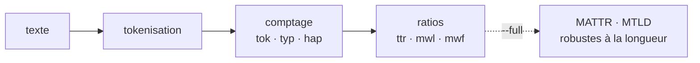
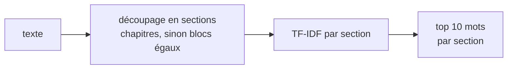
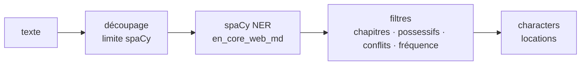
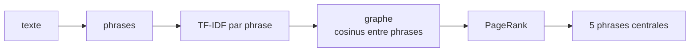
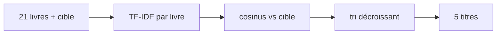
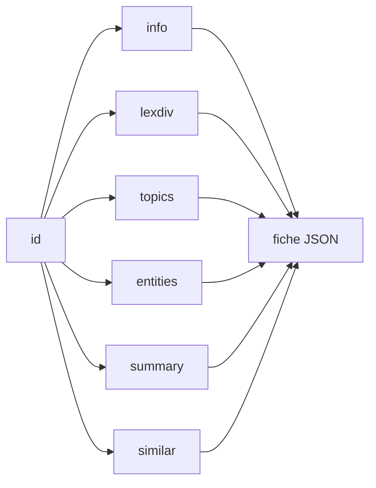

# Bookworm

Génère des **fiches de lecture** à partir de livres du
[Project Gutenberg](https://www.gutenberg.org/) : diversité lexicale, thèmes,
personnages et lieux, résumé, et recommandations de livres similaires.

```console
$ uv run bookworm.py --similar 1661        # The Adventures of Sherlock Holmes
[
  "The Return of Sherlock Holmes",
  "The Memoirs of Sherlock Holmes",
  "Poirot Investigates",
  "The Murder of Roger Ackroyd",
  "The Big Four"
]
```

## Installation

Nécessite **Python 3.12 ou 3.13**.

```bash
uv sync
```

Sans [uv](https://docs.astral.sh/uv/) :

```bash
python3.12 -m venv .venv && source .venv/bin/activate
pip install -r requirements.txt
```

Le modèle spaCy (`en_core_web_md`) s'installe automatiquement dans les deux cas.

## Commandes

```bash
uv run bookworm.py --<commande> <ID>       # ou: python bookworm.py … dans un venv activé
```

| Commande | Sortie |
|---|---|
| `--lexdiv <ID>` | diversité lexicale (`tok`, `typ`, `hap`, `ttr`, `mwl`, `mwf`) |
| `--topics <ID>` | 10 mots-clés par section |
| `--entities <ID>` | personnages et lieux |
| `--summarize <ID>` | résumé en quelques phrases |
| `--similar <ID>` | les 5 livres les plus proches |
| `--card <ID>` | la fiche complète |

`<ID>` est l'identifiant Gutenberg (`11` = *Alice*, `345` = *Dracula*).

Deux options : `--full` (avec `--lexdiv`, ajoute MATTR/MTLD) et `--style` (avec
`--similar`, compare par style d'écriture plutôt que par thème).

## Méthodes

Le pipeline et les choix de conception de chaque commande.

### lexdiv — diversité lexicale



Le **TTR** (mots uniques / total) dépend de la longueur du texte, ce qui le rend
peu comparable d'un livre à l'autre. **MATTR** (TTR moyen sur une fenêtre
glissante) et **MTLD** (longueur moyenne avant que le TTR passe sous 0,72) n'en
dépendent pas ; ils sont activés par `--full`.

### topics — thèmes par section



Découpage par chapitres (regex multi-format ; à défaut, blocs de taille égale),
puis **TF-IDF** où les « documents » sont les sections du livre : un mot ressort
s'il est fréquent dans une section mais rare dans les autres. Les mots trop
fréquents sont écartés par le TF-IDF lui-même, sans liste de stop-words.

### entities — personnages & lieux



NER avec **spaCy `en_core_web_md`** (≈40 Mo, CPU). Le texte est découpé en blocs
(limite de longueur de spaCy), puis les entités sont normalisées et filtrées
(chapitres, possessifs, conflits personnage/lieu, fréquence minimale). La
précision baisse sur l'anglais ancien (fiction du 19ᵉ).

### summarize — résumé extractif



Résumé **extractif** par **TextRank** : les phrases sont reliées par leur
similarité cosinus, et PageRank en extrait les plus centrales. S'appuie sur le
TF-IDF et le cosinus de `similar`. Le résumé reprend des phrases existantes sans
les reformuler ; une approche qui reformule demanderait un modèle entraîné bien
plus lourd. `sumy` (LexRank) donnait un résultat équivalent mais ajoutait nltk et
ses téléchargements.

### similar — livres proches



Chaque livre devient un vecteur TF-IDF ; on compare par **cosinus** (l'angle,
donc insensible à la longueur des livres). Chaque livre garde ses mots les plus
forts **à lui** (`top_n` par livre) plutôt qu'un vocabulaire global, ce qui
préserve les termes signature. Option `--style` : similarité de **style**
(méthode de Burrows sur les mots-outils) au lieu du thème.

### card — assemblage



`--card` rappelle les cinq analyses (plus les métadonnées du livre) et renvoie la
fiche complète.

### Choix transverses

- **Téléchargement** : `urllib` de la bibliothèque standard (pas de dépendance
  externe pour une simple requête GET) ; détection des marqueurs Project
  Gutenberg pour retirer l'en-tête/pied de page légaux.
- **Cache** : décorateur `@cached` — les opérations coûteuses (téléchargement,
  NER, résumé) sont calculées une fois puis relues depuis `.bookcache/`.

> Python 3.14 n'est pas supporté : spaCy 3.8 ne fournit pas encore de paquet pour
> cette version.

## Structure

```
bookworm.py        CLI
src/fetch.py       téléchargement Gutenberg + cache
src/text.py        tokenisation
src/lexdiv.py      diversité lexicale
src/topics.py      thèmes par section (TF-IDF)
src/entities.py    personnages et lieux (spaCy)
src/summarize.py   résumé extractif (TextRank)
src/similar.py     similarité par thème et par style
src/card.py        assemblage de la fiche
```
